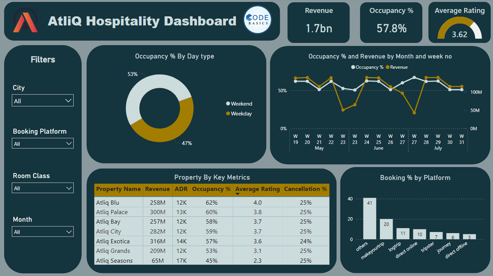

# Analysis-of-AtliQ-Grands-Hospitality-Domain
 
A business intelligence dashboard for a luxury hotel chain to Analyze the Data and give required insights and recommendations.
   

## Business Objective
 

* AtliQ Grands  is a company that owns multiple hotels across various cities of India.
* AtliQ Grands aims to regain its market share and revenue in the hotels, which has been declining due to strategic moves by competitors and ineffective decision-making..
* The goal is to leverage Business and Data Intelligence to make informed decisions, optimize operations, and improve market competitiveness.
   

## Project Scope
 

* **Data Analysis:**  Analyze historical data provided by AtliQ Grands to extract meaningful insights and trends.
 

* **MetricCreation:**  Develop key performance indicators (KPIs) and metrics that align with the business objectives and are required for decision-making.
 

* **Dashboard Development:**  Design and create a dashboard based on the mock-up provided by stakeholders, ensuring it effectively visualizes the necessary metrics.
 

* **Insight Generation:**  Identify and present additional insights beyond the given metric list that could help AtliQ Grands improve their strategic decision-making.
   

## Data Collection & Preparation
 

* There are 5 tables provided for tracking revenue, 3 dimension tables (date, hotel, room) and 2 fact tables (bookings, aggregated bookings)
 

* Power BI was the tool used for creating the visualization/dashboard
 

* The data was imported, analyzed and transformed as per necessity within Power Query
 

* The relationships between the tables were created within Power Pivot
   

## Data Cleaning/Transformation
   

)
   

## Data Modelling
   

   

##  Metric Development
 

* Revenue =  Sum of revenue_realized from Bookings table (in Rs.)
* Total bookings  =  Count of booking_id from Bookings table
* Avg rating  =  Average of ratings from Bookings table
* Total capacity  =  Sum of capacity from Aggregated bookings table
* Total successful bookings  =  Sum of successful bookings from Aggregated bookings table
* Occupancy rate  =  Total successful bookings / Total capacity (in %)
* Total cancelled bookings  =  Count  of  booking_id with status  =  ‘cancelled’  from Bookings table
* Cancellation rate  =  Total cancelled bookings  /  Total bookings (in %)
* ADR (Average Daily Rate) =   the measure of the average paid for rooms sold in a given time period
* Booking  Rate  by Platform  = contribution of each booking platform for bookings in hotels
   

## Dashboard
 

   

* Occupancy Rate By Day Type  =  Donut chart shows the percentage of rooms occupied by weekend and weekday
* Occupancy Rate and Revenue  =  Line chart shows the distribution of revenue and occupancyby Month and week norate by month and week no
* Bookings Rate By Platform =  Column chart shows the distribution of percentage of bookings based on booking Platform
* KPI Table  =  A matrix visual (pivot table) showing the various KPIs across each property
  
  
* Card visuals were placed in to show the values of important KPIs 
* The following filters were provided to slice and dice the data:
  - City
  - Booking platform
  - Room Class
  - Month
* The theme of the dashboard is based on the hospitality industry
* The visuals are interactive in nature
* Tooltips pop-up when hovering over a visual for more information about the data point
   

## Insights & Recommendations
 

1. Improve Occupancy Rate:
 

  - Since weekend occupancy rates are higher (53%) than weekdays (47%), consider offering weekday promotions or discounts to increase occupancy during slower periods.
  - Properties like AtliQ Seasons with a low occupancy rate (45%) should be analyzed to identify the reasons. Consider targeted marketing or improving facilities to attract more guests
  

2. Enhance Customer Experience:
 

  - AtliQ Seasons has the lowest average rating (2.3). Investigate customer feedback and implement improvements in service quality, cleanliness, or facilities to boost customer satisfaction.
  - AtliQ Blu and AtliQ Exotica have relatively good ratings (4.0 and 3.6, respectively). Continue to focus on customer service in these properties to maintain or improve these ratings.
  

3. Optimize Revenue Management:
 

  - AtliQ Exotica has the highest ADR (14K) but only 57% occupancy. Consider adjusting pricing strategies during low-demand periods to balance occupancy and revenue.
  - Properties like AtliQ Palace and AtliQ Blu are generating high revenue. Explore opportunities to upsell or introduce premium services in these high-performing properties
  

4. Diversify Booking Platforms:
 

  - Direct online and offline bookings are relatively low. Invest in marketing strategies to encourage more direct bookings, which typically have lower commission fees compared to third-party platforms.
  - Continue strong partnerships with top-performing platforms like "Others" (41%) and "Makeyourtrip" (20%). Consider negotiating better terms or increased visibility on these platforms.
  

5. Reduce Cancellation Rates:
 

  - All properties show a cancellation rate of 25%. Understanding the reasons behind cancellations could help in implementing policies to reduce this rate, such as more flexible booking options or cancellation penalties.
  

6. Monitor Trends and Make Data-Driven Decisions:
 

  - The dashboard shows fluctuating trends in occupancy and revenue. Regularly monitor these trends to adjust marketing strategies, staffing, and pricing in response to demand changes.
   

## Conclusion
  

* The dashboard highlights key performance indicators for AtliQ Hospitality, showing strong overall revenue and occupancy rates.
* Increase bookings on weekdays, especially in underperforming properties like AtliQ Seasons.
* Improve services in properties with lower ratings to boost guest satisfaction.
* Investigate and reduce high cancellation rates across all properties.
* Adjust pricing in properties with high ADR but low occupancy to balance revenue.
* Focus on increasing direct bookings while maintaining strong partnerships with top-performing platforms.
* Regularly track occupancy and revenue trends to make data-driven decisions for sustained growth and efficiency.
   
